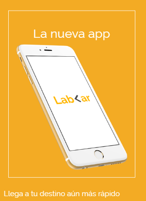
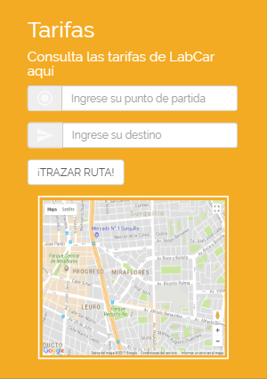
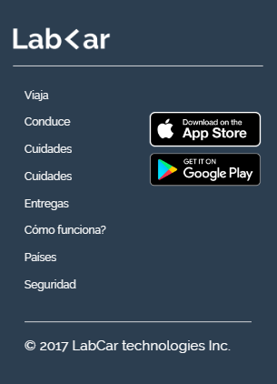
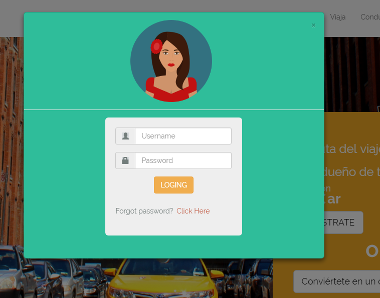
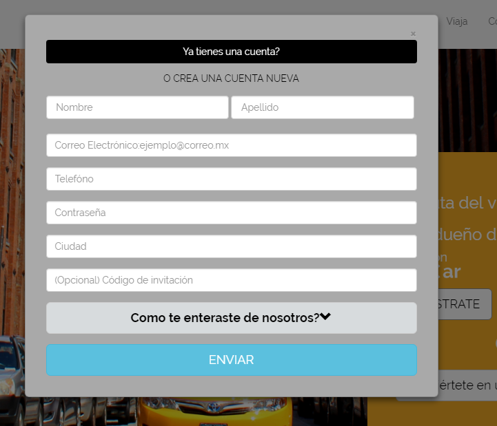
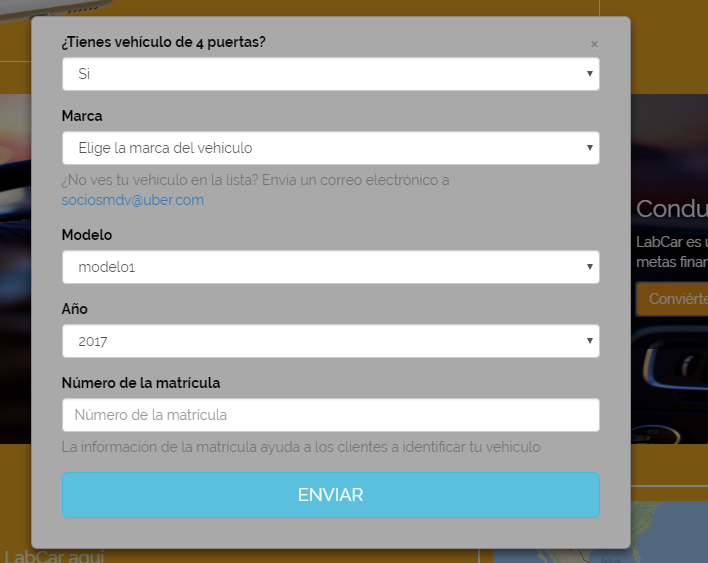

* **Track:** *Common Core*
* **Curso:** *Crea tu propia red social*
* **Unidad:** *No reinventes la rueda*

# **Objetivo del reto**

 * Realizar una versión web :computer: 
 * A la par una versión mobile :iphone:
 * Añadir modales en la Versión web
 * Implementación de [Bootstrap](http://getbootstrap.com/docs/3.3/)

# **Producto final**

## *Versión mobile*

## ***Modal Iniciar sesión***

## ***Modal Regístrate***

## ***Modal Conviertete en conductor***

